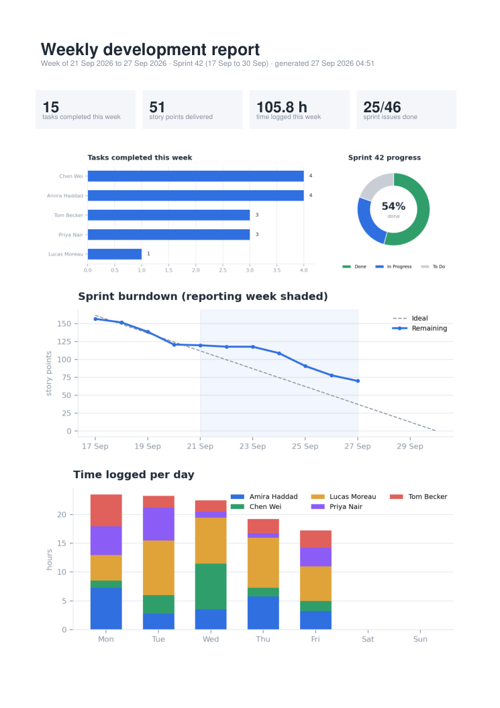

# Jira weekly developer report

Generates a weekly PDF that shows what the team shipped: tasks completed per developer, sprint progress and burndown, and hours logged per developer per day, with a table of every task completed that week.



Full sample (made with `--demo` data): [sample/jira-weekly-2026-09-21.pdf](sample/jira-weekly-2026-09-21.pdf)

## What it reads from Jira

- **Current sprint** of the board (Agile API), with status category and story points for every issue, for the progress ring and the burndown.
- **Issues resolved in the reporting week** (JQL `resolved >= … AND statusCategory = Done`), for the per-developer chart and the table.
- **Worklogs started in the reporting week** on any issue of the board, for the hours chart. Worklogs are filtered by their start date, so time logged on older tickets still counts in the week it was worked.

Paging is handled for boards of any size. Story points come from a configurable custom field because every Jira site names it differently.

## Run

```
pip install -r requirements.txt
cp .env.example .env         # fill in URL, email, API token, board id
python jira_report.py                     # last full week (Mon-Sun)
python jira_report.py --week 2026-09-21   # a specific week
python jira_report.py --demo              # sample data, no Jira needed
```

The API token stays in your `.env` on your own machine or server.

## Settings

| Setting | Where to find it |
|---|---|
| `JIRA_URL` | Your site address, e.g. `https://your-team.atlassian.net` |
| `JIRA_EMAIL` | The email you sign in to Jira with |
| `JIRA_API_TOKEN` | Atlassian account settings → Security → **Create and manage API tokens** (`https://id.atlassian.com/manage-profile/security/api-tokens`) |
| `JIRA_BOARD_ID` | The number in the board's address, e.g. `.../projects/APP/boards/12` → `12` |
| `JIRA_STORY_POINTS_FIELD` | Optional. Open `https://your-team.atlassian.net/rest/api/3/field` while signed in and search for "Story point"; use its `id`, e.g. `customfield_10016`. Without it, points show as 0 and the burndown counts nothing. |
| `REPORT_TITLE` | Optional heading for the PDF |

## Every week, automatically

- **Linux cron:** `0 8 * * MON cd /opt/jira-report && .venv/bin/python jira_report.py`
- **Windows Task Scheduler:** a weekly task running `python jira_report.py` in this folder.
- Mailing the PDF or posting it to Slack is a small addition on top of the generated file.
